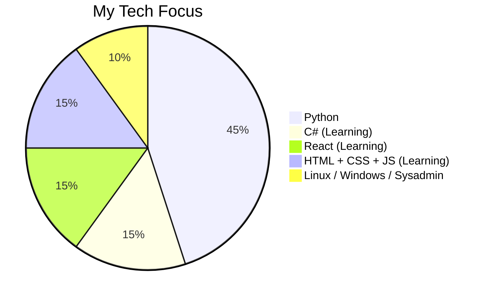

<div align="center">


<br/>


<br/>


<br/><br/>


[](https://samzalaf.github.io/Zalaf_Gallery/)

</div>

---

## 🧑‍💻 About Me

```python
zalaf = {
    "name":       "Mohamad Zalaf",
    "username":   "SAMZalaf",
    "university": "Syrian Virtual University 🎓",
    "degree":     "ITE — Information Technology Engineering (Currently Enrolled 📖)",
    "location":   "Syria 🇸🇾",
    "focus":      ["Python Development", "Linux", "Building Cool Stuff"],
    "learning":   ["C#", "React", "HTML + CSS + JS"],
    "hobbies":    ["Vibe Coding ✨", "Open Source", "Problem Solving"],
    "emails":     [
                    "MohamadZalaf@outlook.com",
                    "Mohamadzalaf2017@gmail.com",
                    "MohamadZalaf0@gmail.com"
                  ],
    "status":     "🟢 Open to collaboration"
}
```

---

## 🛠️ Tech Stack

### ✅ Proficient
<p align="left">
  
</p>

### 📚 Currently Learning
<p align="left">
  
</p>

### 🔧 Tools & Environment
<p align="left">
  
</p>

---

## 📊 Skills Overview



---

## 📈 GitHub Stats

<div align="center">


<br/><br/>


<br/><br/>


</div>

---

## 🚀 Projects

### ✅ Completed / Live

| Project | Description | Tech | Link |
|---------|-------------|------|------|
| 🖼️ **Zalaf Gallery** | Personal portfolio & projects gallery | HTML · CSS · JS | [](https://samzalaf.github.io/Zalaf_Gallery/) |

---

### 🔧 In Progress

| Project | Description | Tech | Status |
|---------|-------------|------|--------|
| 🤖 **SMSBot** | Telegram bot for SMS automation & messaging | Python · Telegram API |  |
| 📱 **Android App** | Mobile application (details coming soon) | TBD |  |
| 🖥️ **H\*\*\*\*S\*\*\*** | Stealth project — stay tuned 👀 | Python |  |

---

## 🤝 Connect With Me

<div align="center">

[](https://samzalaf.github.io/Zalaf_Gallery/)
[](https://t.me/MohamadZalaf)
[](https://www.facebook.com/MohamadZalaf0)
[](https://www.instagram.com/MohamadZalaf0)
[](mailto:MohamadZalaf@outlook.com)
[](mailto:Mohamadzalaf2017@gmail.com)
[](mailto:MohamadZalaf0@gmail.com)

</div>

---

<div align="center">


*"Code is not just syntax — it's a way of thinking."*

**Mohamad Zalaf © 2025**

</div>
