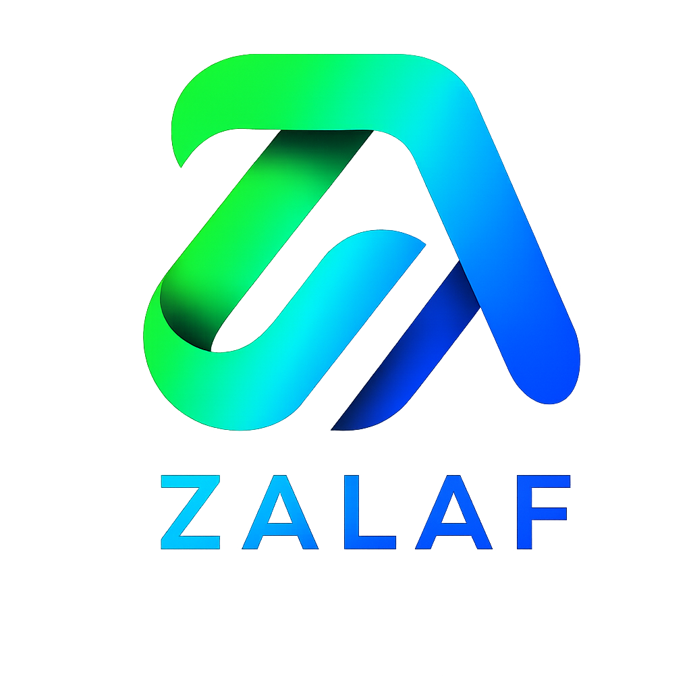
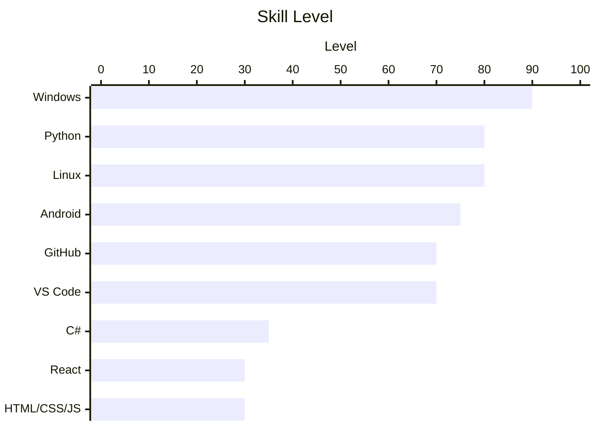
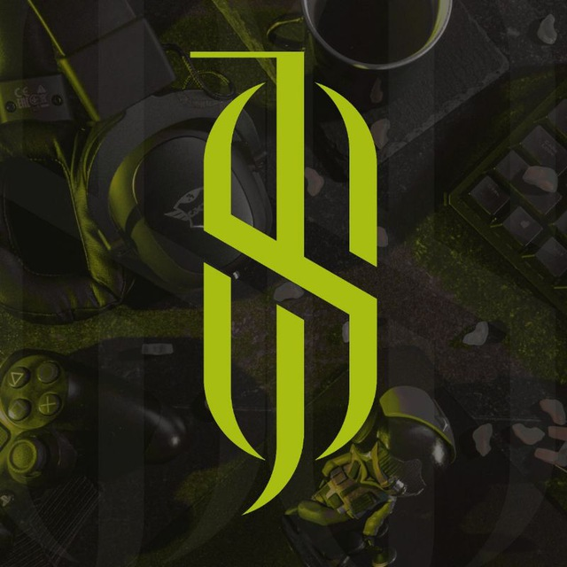

 

 

  

---

## 🧑‍💻 About Me

<table>
  <tr>
    <td>👤 <b>Name</b></td>
    <td>Mohamad Zalaf</td>
  </tr>
  <tr>
    <td>🎓 <b>University</b></td>
    <td>Syrian Virtual University</td>
  </tr>
  <tr>
    <td>📖 <b>Degree</b></td>
    <td>ITE — Information Technology Engineering <i>(Currently Enrolled)</i></td>
  </tr>
  <tr>
    <td>🇸🇾 <b>Location</b></td>
    <td>Syria</td>
  </tr>
  <tr>
    <td>🔭 <b>Focus</b></td>
    <td>Python Development · Linux · Building Cool Stuff</td>
  </tr>
  <tr>
    <td>🌱 <b>Learning</b></td>
    <td>C# · React · HTML + CSS + JS</td>
  </tr>
  <tr>
    <td>✨ <b>Hobbies</b></td>
    <td>Vibe Coding · Open Source · Problem Solving</td>
  </tr>
  <tr>
    <td>📧 <b>Emails</b></td>
    <td>
      <a href="mailto:MohamadZalaf@outlook.com">MohamadZalaf@outlook.com</a> 
      <a href="mailto:Mohamadzalaf2017@gmail.com">Mohamadzalaf2017@gmail.com</a> 
      <a href="mailto:MohamadZalaf0@gmail.com">MohamadZalaf0@gmail.com</a>
    </td>
  </tr>
  <tr>
    <td>🟢 <b>Status</b></td>
    <td>Open to collaboration</td>
  </tr>
</table>

---

## 🛠️ Tech Stack

### ✅ Proficient

  

### 📚 Currently Learning

  

### 🔧 Tools & Environment

  

---

## 📊 Skills Overview

---

## 📈 GitHub Stats

  

  

---

## 🚀 Projects

### ✅ Completed / Live

<table>
  <tr>
    <td width="120" align="center">
       
      <b>Static Bot</b>
    </td>
    <td>
      <b>📡 Proxy Management System &amp; 🛒 E-Shop</b> 
      Telegram bot for selling multi-type proxies, customer management, and more.  
      
      
      
      
      
        
      📅 Dec 2024 &nbsp;|&nbsp;
      
      &nbsp;
      
    </td>
  </tr>
  <tr><td colspan="2">
</td></tr>
  <tr>
    <td width="120" align="center">
       
      <b>Lofi Bot - lite</b>
    </td>
    <td>
      <b>🛒 E-Shop &amp; 👤 Account Management System</b> 
      Telegram bot for selling multi-type accounts, customer management, and more.  
      
      
      
      
        
      📅 Dec 2025 &nbsp;|&nbsp;
      
      &nbsp;
      
    </td>
  </tr>
  <tr><td colspan="2">
</td></tr>
  <tr>
    <td width="120" align="center">
       
      <b>Zalaf Gallery</b>
    </td>
    <td>
      <b>🖼️ Personal Portfolio &amp; Projects Gallery</b> 
      A personal website showcasing all projects, skills, and contact info.  
      
      
      
        
      
      &nbsp;
      
    </td>
  </tr>
</table>

---

### 🔧 In Progress

<table>
  <tr>
    <td width="120" align="center">
        
      <b>SMSBot</b>
    </td>
    <td>
      <b>🤖 SMS Automation &amp; Messaging Bot</b> 
      Telegram bot for SMS virtual numbers .  
      
      
        
      
    </td>
  </tr>
  <tr><td colspan="2">
</td></tr>
  <tr>
    <td width="120" align="center">
        
      <b>H****S***</b>
    </td>
    <td>
      <b>📱 Android App — Stealth Project</b> 
      Stay tuned 👀 Details coming soon.  
      
      
        
      
    </td>
  </tr>
</table>

---

## 🤝 Connect With Me

---

  
  

*"Code is not just syntax — it's a way of thinking."*

**Mohamad Zalaf © 2025**

